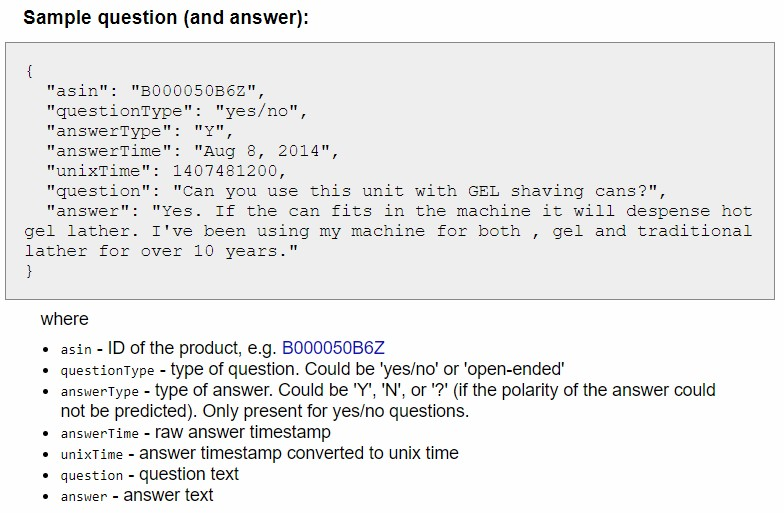

# About

Last update: 06/01/2020

For the next few days:
**Build a Chatbot!**

Train a chatbot based on machine learning (seq2seq model) that can answer short questions or can do (convincing) small talk with a user. For example answering questions about a product (customer service).
Example: [Chatbot Tutorial with PyTorch](https://pytorch.org/tutorials/beginner/chatbot_tutorial.html)

# Preprocessing #

`amazon_preprocessing.ipynb`:

In the PyTorch Tutorial, the [Cornell Movie-Dialogs corpus](https://www.cs.cornell.edu/~cristian/Cornell_Movie-Dialogs_Corpus.html) was used. It contains 220,579 conversational exchanges between 10,292 pairs of movie characters. However, I rather want to use a "more natural" type of text than movie dialogs to train a chatbot. So I decided to try the [Amazon Question Answer Dataset](http://jmcauley.ucsd.edu/data/amazon/qa/) by Julian McAuley.

This dataset contains Question and Answer data from Amazon, totaling around 1.4 million answered questions. I decided to take a subset from the whole dataset, the set from the Electronics category which still has 314,263 questions.

## Next Steps ##

# Training #

`main.ipynb`

## Next Steps ##

- Repeat the theory and concepts of a seq2seq chatbot model again (Encoder-Decoder architecture, Attention, Teacher Forcing, Greedy Search, Beam Search etc.)
- Try the code of the PyTorch tutorial with the provided Cornell Movie-Dialogs corpus if it works without any problems. Importantly, take a close look at the chatbot implementation during inference time (chatting with the bot in real-time).
- Clean up the `main.py` code. Possibly divide the long code in several Python files (training file, file with the model architecture etc.) to give it a better structure.
- Thourough testing of the chatbot with the new Amazon dataset.
